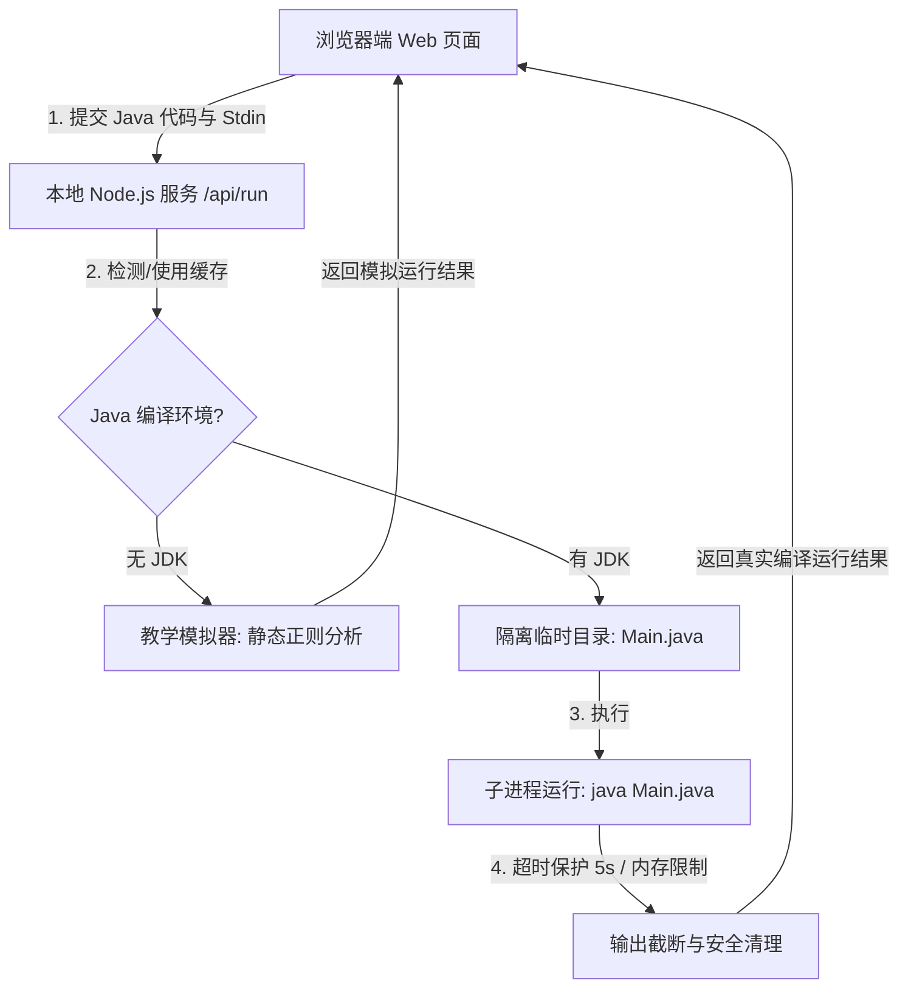

# ☕ java-path

> **面向初学者的 Java 交互式学习与编译运行工作台原型**

[](https://pursuing-coding.github.io/java-path/)
[](LICENSE)
[](https://nodejs.org/)
[](https://playwright.dev/)

`java-path` 是一个开箱即用的 Java 学习工作台。它集成了**课程讲解**、**官方资料**、**学习路径**、**代码编辑器**、**标准输入 (stdin)**、**控制台输出**和**自动化提交验证**。全网共有 **13 个 Level、104 个关卡**，逐步引导学习者从 `Hello World` 迈向 `Spring Boot` 实战和高并发 JVM 原理。

---

## 🔗 在线体验 / Live Demo

🚀 **直接访问在线体验网址**：👉 **[https://pursuing-coding.github.io/java-path/](https://pursuing-coding.github.io/java-path/)** 👈

> [!TIP]
> **在线预览模式（免 JDK 安装）**：网页端集成了轻量级语法解析模拟引擎，支持直接预览体验全网共 **13 个 Level、104 个关卡** 的 Java 基础输出、变量和字符串拼接！
> 如需体验真实的 Java SDK 编译运行、安全沙箱控制及标准输入（Scanner）交互，请按照下方 [快速开始](#-快速开始) 指引在本地启动 Node.js 服务。

---

## 🌟 核心特性

- 🖥️ **一体化交互工作台**：左侧展示课程讲解与官方规范，右侧配备完整的代码编辑器与控制台。
- ⚡ **智能预览与本地沙箱双轨制**：
  - **预览模式（无需 JDK）**：通过浏览器端语法模拟引擎，支持基础输出语句、简单变量声明和字符串拼接预览。
  - **沙箱模式（需本地 JDK）**：本地服务自动检测 `java` 环境，支持带标准输入（Scanner）的单文件真实编译运行，并实施资源隔离与超时限制。
- 📈 **自动锁定与进度同步**：通关验证通过后自动解锁下一关，进度与临时编辑器草稿自动持久化在浏览器的 `localStorage` 中。
- 🌓 **日夜间主题切换**：支持全页面的深色和浅色模式，专为编码设计的色彩方案，保护视力。
- ⚙️ **极致性能优化**：
  - **Java 运行状态缓存**：在服务端对 Java 环境检查结果进行高频缓存，降低编译执行的启动延迟。
  - **Autosave 写入防抖**：编辑器草稿的本地存储写入增加防抖机制，保障低配设备上的打字输入体验，并完美确保跳转和提交时即时存盘。

---

## 📐 运行架构图



---

## 📂 项目目录结构

```text
java-path/
├── .github/workflows/       # GitHub Actions 自动化部署工作流
├── public/                  # 静态前端资源目录
│   ├── app.js               # 前端核心业务逻辑（编辑器事件、防抖草稿保存、Scanner 适配、关卡校验）
│   ├── styles.css           # 整体响应式与暗黑主题样式设计
│   ├── course-outline.js    # 13 个 Level 的大纲目录配置
│   ├── lesson-content-*.js  # 具体的关卡数据（介绍、拆解、示例、答案、检测项）
│   ├── index.html           # 页面骨架
│   └── favicon.svg          # 网站 Favicon
│
├── scripts/                 # 辅助脚本
│   └── validate-lessons.js  # 自动化校验关卡合法性、完整性及官方白名单链接
│
├── tests/                   # 测试用例目录
│   └── ui-smoke.spec.js     # 基于 Playwright 的端到端桌面与移动端 UI 冒烟测试
│
├── server.js                # 极简高性能 Node.js 后端服务器（健康检查、静态服务、Java 安全沙箱运行）
├── package.json             # 依赖管理及启动命令
└── playwright.config.js     # Playwright 测试配置文件
```

---

## 🚀 快速开始

### 1. 本地运行开发服务

若要体验真实的 Java 编译运行，请确保本地配置了 `java` 命令行环境（JDK）。

```powershell
# 1. 克隆并进入目录
cd "java-path"

# 2. 安装依赖并启动本地服务
npm install
npm start
```

启动后，访问浏览器：
👉 **[http://localhost:4173](http://localhost:4173)**

*提示：若 4173 端口被占用，可通过环境变量更换端口启动，例如：`PORT=4273 npm start`。*

### 2. 自动化项目检查与验证

项目内置了自动化关卡合法性检测和 UI 自动化回归测试，确保前后端功能稳定：

```powershell
# 安装测试所需的浏览器内核
npx playwright install chromium

# 执行验证任务 (检查关卡规范并运行 Playwright 冒烟测试)
npm run verify
```

---

## 🔒 云端沙箱与编译运行安全设计

本项目原型在本地开发状态下直接依托 Node.js 的子进程执行。在正式上线的云端产品化设计中，建议采用以下安全防线：

1. **容器化隔离**：每次代码运行单独实例化一个轻量级容器（例如 Docker），代码运行结束后立即销毁容器与临时文件。
2. **硬件额度限制**：严格限制用户代码进程的 CPU 使用率、运行内存（如最大 256MB）、磁盘写入权限及网络访问。
3. **超时截断**：超过 `5s` 未执行完毕的进程自动触发 `SIGKILL` 强杀保护，以防死循环消耗服务器资源。
4. **输出内容控制**：限制标准输出与标准错误的最大字符长度（如 `12,000` 字符），防止打印无限字符撑爆浏览器及传输通道。
